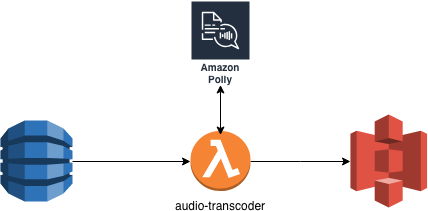

# Sam-handson
If you are here, you choose a framework created by a cloud provider.

In this hands-on, we are going to read a rssFeed, convert it to MP3 and saved it in database.

We are going to use the folowing services:

- Lambda
- CloudWatch 
- DynamoDB
- Polly
- S3
- Api-gateway

So let's get started :blush:

## First Step : Prepare the field

For this hands-on, you need to install node version 8.9
you can use node version manager to handle multiple node version

- The installation instructions are available here: https://github.com/creationix/nvm

- Check you install: `nvm --version`

- Install node 8.9.4 using : `nvm i 8.9.4`

- Check you node default version: `node --version`

- Use `nvm use 8.9.4` to switch node version

Install Docker:

    https://store.docker.com/editions/community/docker-ce-desktop-mac

- Create an account on DockerHub 

- Install pip: 

https://pip.pypa.io/en/stable/installing/

- Install AWS Command line interface

`pip install awscli --upgrade --user` 

- Verify that the AWS CLI is installed correctly

`aws --version`

- Sam needs a S3 bucket to save to packaged code: aws s3 mb s3://`YOUR_BUCKET_NAME`

## Second Step : Prepare the weapon

Checkout the projet and start coding :cloud:

- In the audio-transcoder folder, you have to run `npm i` to install the function depencencies
- In the audio-rss-reader folder, you have to run `npm i` to install the function depencencies

## Third Step : Fight

### Create the Rss reader function

The RssReader function reads every day the Amazon blog rssFeed and saves it on dynamoDB

The function code is available on the package rss-reader

- Create DynamoDB table:
    
    To define a DynamoDB Table, you should add a table description in the template.yml ressources section.
    
    https://docs.aws.amazon.com/serverless-application-model/latest/developerguide/serverless-sam-template.html#serverless-sam-template-simpletable

    `sam package --template-file template.yaml --output-template-file packaged.yaml     --s3-bucket YOUR_BUCKET_NAME`    
 
    `sam deploy     --template-file packaged.yaml  --capabilities CAPABILITY_IAM   --stack-name YOUR_APP_NAME`
   
    Check the creation of your table in the following url:

    https://eu-central-1.console.aws.amazon.com/dynamodb/home?region=eu-central-1#tables:

- Create your function:

    https://docs.aws.amazon.com/serverless-application-model/latest/developerguide/serverless-sam-template.html#serverless-sam-template-function

- Add function policies to be able to write in a DynamoDB table
    
    https://github.com/awslabs/serverless-application-model/blob/develop/examples/2016-10-31/policy_templates/all_policy_templates.yaml

- Don't forget to change the default Function timeout. 
    
- Add the table name to the function enviromenent variable  
    
- Deploy your application:

`sam package --template-file template.yaml --output-template-file packaged.yaml     --s3-bucket YOUR_BUCKET_NAME`    
 
`sam deploy     --template-file packaged.yaml  --capabilities CAPABILITY_IAM   --stack-name YOUR_APP_NAME`

- Check the creation of your first Lambda on the AWS console:

https://eu-central-1.console.aws.amazon.com/lambda/home?region=eu-central-1#/functions 

- Check the schuedeled task that triggers the Lambda

https://eu-central-1.console.aws.amazon.com/cloudwatch/home?region=eu-central-1#rules:         

- Check the role created for the RssReader function:

https://console.aws.amazon.com/iam/home?region=eu-central-1#/roles

- Select DynamoDB service and check if you have the last AWS's blog articles
    
### Create the audio transcoder function

- Create the AudioTranscoder function: 
    
    Your function should be able to to acces to polly and s3
    
    The audio transcoder should be able to read the dynamoDB stream 

- Create the S3 bucket:

    https://docs.aws.amazon.com/fr_fr/AWSCloudFormation/latest/UserGuide/aws-properties-s3-bucket.html
   
- Add the the bucket name to the AudiTranscoder function enviromenent variable

- Deploy the stack again

`sam package --template-file template.yaml --output-template-file packaged.yaml     --s3-bucket YOUR_BUCKET_NAME`    

`sam deploy     --template-file packaged.yaml  --capabilities CAPABILITY_IAM   --stack-name YOUR_APP_NAME`

- Trigger the RssReader function again and verify that you have the generated MP3 in your S3 bucket

### Trigger the RssReader Manually:

Sometimes, we need to sychronize the articles manually. To do this, we are going to trigger the RSSreader function by a Http call.

- Create an http endpoint to trigger the RssReader function

https://docs.aws.amazon.com/serverless-application-model/latest/developerguide/serverless-sam-template.html#serverless-sam-template-function

- Check the APIGateway Service to see what hapenned.

https://eu-central-1.console.aws.amazon.com/apigateway/home?region=eu-central-1#/welcome

- Test the new feature by a simple curl

